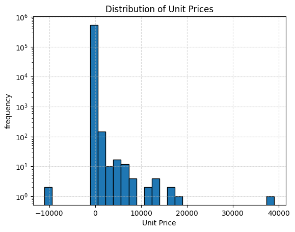
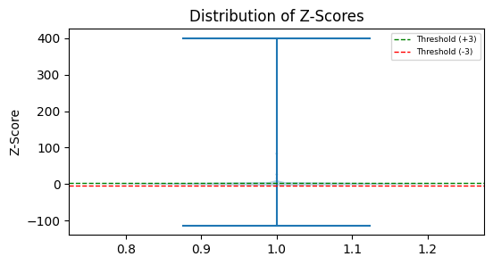
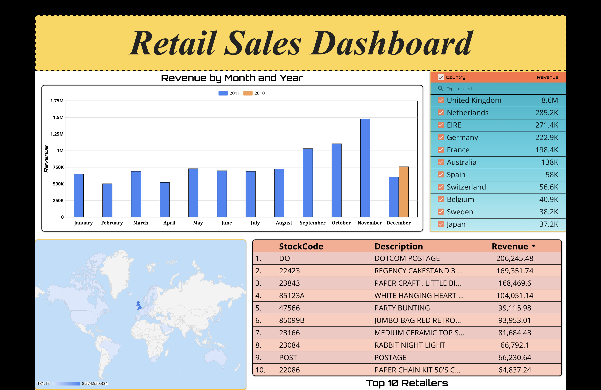

# E-Commerce Sales Data Cleaning & Analytics Pipeline

This project demonstrates how I clean, transform, and analyze raw transactional data from a UK-based online retailer. Using Python, SQL/BigQuery, dbt, and Looker Studio, I built an end-to-end data pipeline to generate actionable business insights and interactive analytics dashboards. The workflow reflects industry best practices for data analytics and engineering.

## Dataset Overview

I used the [UCI Online Retail dataset](https://archive.ics.uci.edu/dataset/352/online+retail), which includes transactional records from a UK-based online retailer between December 2010 and December 2011. The dataset contains 541,909 rows and 8 columns:

- InvoiceNo
- StockCode
- Description
- Quantity
- InvoiceDate
- UnitPrice
- CustomerID
- Country

This rich dataset offers insight into customer purchasing behavior, sales trends, product performance, and transactional patterns within the e-commerce domain.

## Project Goal

My goal is to build a robust, end-to-end data pipeline that cleans, transforms, and analyzes the online retail transactional data to support insightful business decisions. 

Using Python, SQL/BigQuery, dbt, and Looker Studio, I focus on producing clean, reliable datasets and interactive dashboards that highlight key sales trends, customer behaviors, and product performance metrics.

Preserving data integrity and reproducibility is central to my approach, so I maintain a raw dataset snapshot before executing any data cleaning or transformation steps.

## Data Cleaning & Preprocessing

To ensure the dataset is accurate and reliable for analysis, I performed the following cleaning steps:

- **Duplicate Removal:**  
  Identified and removed 5,268 duplicate rows by checking for exact duplicates across all columns, keeping only the first occurrence.

- **Handling Missing Descriptions:**  
  Removed 1,454 placeholder transactions where `Description` was missing, `UnitPrice` was zero, and `CustomerID` was also missing. These records offered no actionable information.

- **Problematic Invoice Exclusion:**  
  Excluded two invoices (`A563187`, `A563186`) with extreme negative `UnitPrice` outliers to maintain data integrity.

- **Filtering Negative Quantities:**  
  Negative quantities generally represent returns or cancellations. I filtered out extreme negative values by keeping only rows where `Quantity` was greater than or equal to -10, preserving legitimate returns while removing improbable bulk adjustments.

These rigorous cleaning steps reduced noise and anomalies, preparing the dataset for meaningful analysis and modeling.

## Outlier Detection & Analysis

To identify and manage extreme or unusual values that could distort analysis, I applied two complementary statistical methods:

- **Interquartile Range (IQR) Method:**  
  Using the 25th percentile (Q1) and 75th percentile (Q3), I calculated the interquartile range (IQR) and flagged values outside the range \[Q1 - 1.5 * IQR, Q3 + 1.5 * IQR\] as outliers.  
  This method detected 39,450 outliers in the `UnitPrice` column, helping identify transactions with unusually high or low prices.

- **Z-score Method:**  
  I computed the Z-score for `UnitPrice` to measure how many standard deviations values lie from the mean. Transactions with absolute Z-scores greater than 3 were flagged as outliers. This technique found 360 extreme outliers.

**Handling Outliers:**

- Positive outliers, such as high postage fees and marketplace charges, were retained since they reflect valid business operations.
- Extreme negative outliers, including certain invoices with aberrant values, were removed to improve data quality.
- Negative quantities were constrained to reasonable returns (Quantity ≥ -10) to filter out unlikely bulk adjustments.

This two-pronged outlier detection ensures robust data integrity and supports reliable downstream analytics.

## Visualizations & Key Insights

To better understand the distribution and characteristics of the dataset, I created key visualizations:

- **Histogram of Unit Prices:**  
  A histogram with a logarithmic y-axis revealed that most transactions have low unit prices, while a small number exhibit extremely high values. This visualization helped confirm the presence of outliers detected statistically and provided insight into price distribution skewness.

  📸 **Screenshot**  

- **Violin Plot of Z-Scores:**  
  The violin plot of Z-scores illustrated the concentration of most data points near the mean within ±3 standard deviations and highlighted the presence of extreme positive and negative outliers beyond these thresholds.

  📸 **Screenshot**  

**Key Observations:**

- The majority of sales involve relatively low-priced items, consistent with typical online retail patterns.
- Extreme positive values in `UnitPrice` correspond to valid entries such as postage fees and marketplace charges, which are important for financial analysis.
- Negative values in quantity confirm the presence of returns and cancellations, but extreme negative values were filtered out to improve data quality.

These visualizations complement the statistical outlier detection and emphasize the importance of nuanced data cleaning for robust analysis.

## BigQuery Data Modeling and Views

After cleaning the data, reusable views were created in BigQuery to simplify analysis and reporting.

- Views enable fast, aggregated queries and act as reliable data sources for dashboards built in Looker Studio.  
- All view SQL scripts are saved in the `sql/` folder for easy maintenance and reuse.  
- This approach demonstrates skills in both data cleaning and cloud-based data modeling, forming a solid foundation for scalable analytics.

### Combined Sales View

A reusable view created in BigQuery that consolidates sales data by country, year, month, and product for streamlined analysis and reporting.

- **Purpose:** Provides aggregated sales revenue (`Quantity * UnitPrice`) by country, product, and time for a unified data source.  
- **Description:**  
  Extracts `Country`, year and month from `InvoiceDate`, product details (`StockCode`, `Description`), and calculates total revenue grouped by these dimensions.  
- **Usage:**  
  Run this script in BigQuery to create the `combined_sales` view within the `retail_data` dataset.  
  This view acts as a single source for all Looker Studio dashboards and reports, eliminating the need for data blending.

## Looker Studio Dashboard

This interactive dashboard visualizes retail sales data with the following features:

- **Sales Trends:** Vertical bar charts showing monthly sales comparison between years.  
- **Top Retailers:** Ranked tables highlighting best-selling products by revenue.  
- **Geographic Insights:** Geo chart and filters allowing users to explore sales by country.  
- **Interactive Filtering:** Country filter control applies across multiple charts for synchronized analysis.

## Project Links

Explore the interactive dashboard and view the SQL scripts used to build the data models:

- Live Looker Studio Dashboard: [Retail Sales Dashboard](https://lookerstudio.google.com/reporting/99e94079-96ca-4621-8e28-8b1dcdd59174)  

📸 **Screenshot**  
